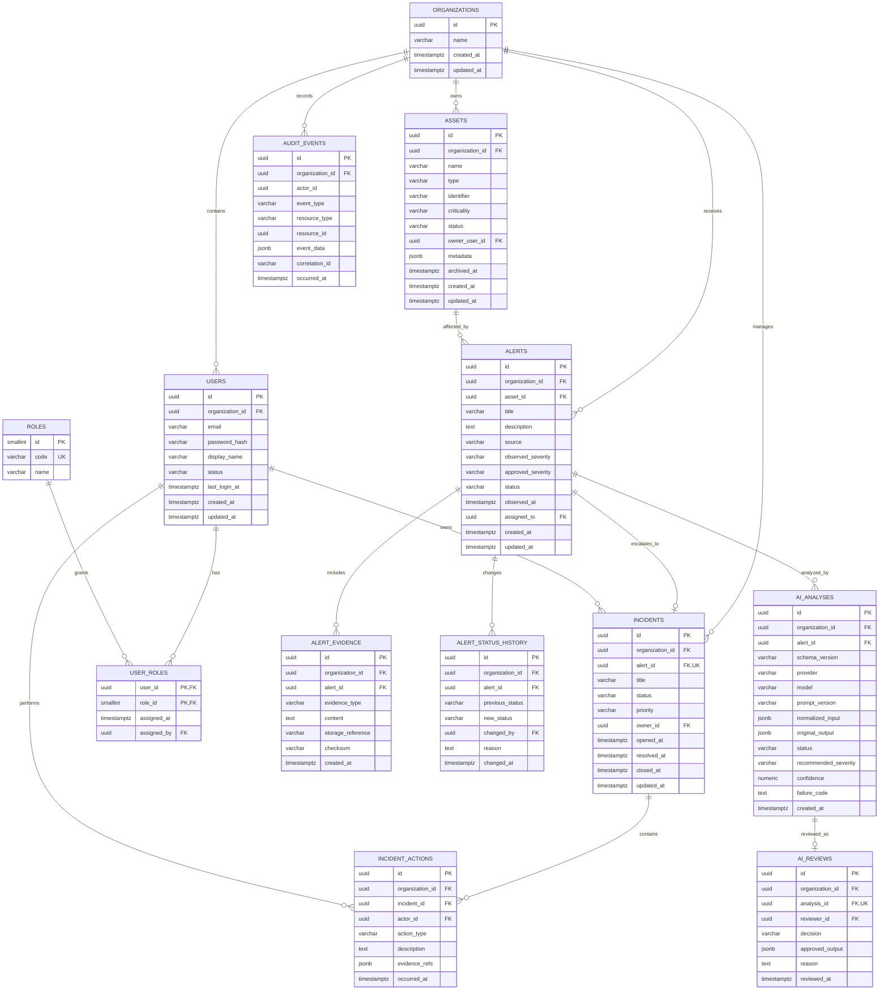

# DefenSME logical data model

**Status:** C01 implementation baseline  
**Database:** PostgreSQL 17  
**Migration authority:** Flyway

This is the logical target model for the course MVP. The existing `organizations` and `audit_events` tables remain valid; later commits add the remaining tables through incremental migrations. JPA must use `ddl-auto=validate` and must not generate production schema.

## Required invariants

1. Every operational row carries `organization_id`; repository queries and service authorization must match it to the authenticated organization.
2. Emails are unique within an organization using a normalized lower-case value.
3. Asset identifiers are unique within `(organization_id, type, identifier)` when not archived.
4. Alert state is one of `NEW`, `TRIAGED`, `IN_PROGRESS`, `RESOLVED`, `CLOSED`; transitions are enforced by the backend, not database clients.
5. `observed_severity`, AI `recommended_severity`, and human `approved_severity` remain separate.
6. `AI_ANALYSES.original_output` is immutable. A human correction is stored only in `AI_REVIEWS.approved_output`.
7. An analysis may have at most one final review; a new analysis request creates a new analysis record.
8. An alert has at most one MVP incident. Reopening changes incident state; it does not create a duplicate.
9. Audit events are append-only through the application API.
10. Hard deletion is excluded from the MVP. Assets use archive state; operational history is retained according to the documented course limitation.

## Index baseline

| Table | Index |
|---|---|
| `users` | unique `(organization_id, lower(email))`; `(organization_id, status)` |
| `assets` | `(organization_id, status)`; `(organization_id, criticality)`; partial unique active identifier |
| `alerts` | `(organization_id, status, observed_at desc)`; `(organization_id, approved_severity)`; `(asset_id, observed_at desc)` |
| `alert_status_history` | `(alert_id, changed_at)` |
| `ai_analyses` | `(alert_id, created_at desc)`; `(organization_id, status)` |
| `incidents` | `(organization_id, status, priority)`; `(owner_id, status)` |
| `incident_actions` | `(incident_id, occurred_at)` |
| `audit_events` | `(organization_id, occurred_at desc)` and `(resource_type, resource_id, occurred_at)` |

## Migration order

1. C02: identity, roles, organization timestamps, and audit correlation support.
2. C04: assets.
3. C07: alerts, evidence, and status history.
4. C11: AI analyses and reviews.
5. C13: incidents and actions.

