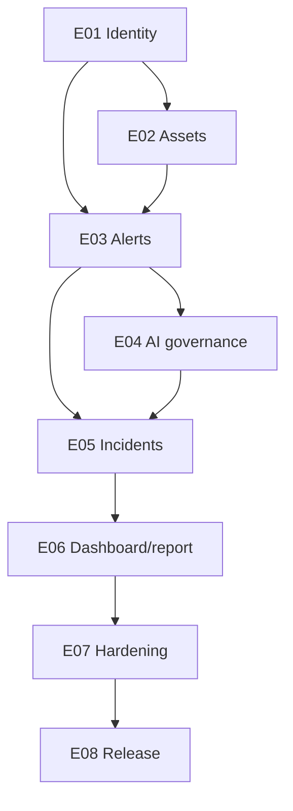

# DefenSME implementation backlog

This backlog decomposes PRD v1.0 into the planned delivery sequence. `Must` items are required for v1.0.0; `Should` items may be simplified but cannot silently disappear.

| Epic | Outcome | Requirements | Planned commits | Priority |
|---|---|---|---|---|
| E01 Identity and organization | Secure authentication and tenant-scoped authorization | FR-AUTH-001/002, SEC-001/002/003/006 | C02–C03 | Must |
| E02 Asset inventory | Register, find, update, and archive protected assets | FR-ASSET-001, SEC-002/004 | C04–C06 | Must |
| E03 Alert management | Create/import alerts and enforce lifecycle/history | FR-ALERT-001–004, SEC-004/005 | C07–C09 | Must |
| E04 AI analysis governance | Structured advisory output with accountable review/fallback | FR-AI-001–003, AI-001–007 | C10–C12 | Must |
| E05 Incident response | Assign, document, resolve, close, and reopen incidents | FR-INC-001, FR-ALERT-003/004 | C13–C15 | Must |
| E06 Dashboard and reporting | Show scoped operational posture and reviewed summaries | FR-DASH-001, FR-REPORT-001 | C16–C18 | Should |
| E07 Security and quality | Harden trust boundaries, errors, logs, accessibility, and performance | SEC-001–007, NFR-001–006 | C19–C21 | Must |
| E08 Release and evidence | Verify E2E, complete course evidence, and publish v1.0.0 | GOAL-01–04 | C22–C24 | Must |

## Dependency order

## Backlog policies

- A story is Ready only when its requirement, role, validation, failure path, audit effect, and acceptance evidence are known.
- A story is Done only after relevant tests pass and documentation/traceability are updated.
- New external integrations, automated remediation, billing, custom model training, endpoint agents, antivirus, and SIEM capabilities remain outside the MVP.
- Unresolved product questions use the safe default and remain visible; they are not silently decided in code.

## Release slices

| Slice | Commits | Demonstrable result |
|---|---|---|
| Foundation | C01–C03 | Architecture plus authenticated role-aware backend. |
| Operational data | C04–C09 | Assets and alerts work from UI to database. |
| Intelligent guidance | C10–C15 | AI advice is reviewed and converted into traceable incident work. |
| Management view | C16–C18 | Scoped metrics and reviewed reports. |
| Release quality | C19–C24 | Hardened, tested, documented, demo-ready v1.0.0. |

